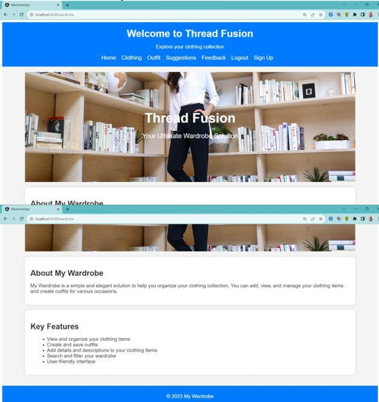
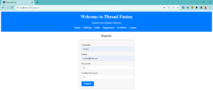
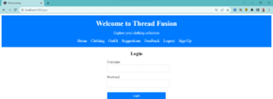
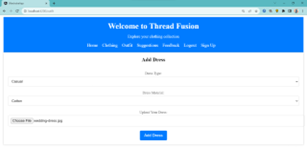
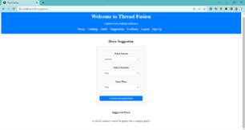
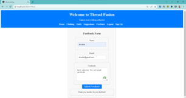
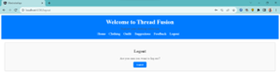

# 👚 SmartCloset360 – Your Intelligent Digital Wardrobe

> _"Your wardrobe tells your story — SmartCloset360 makes sure it's a good one."_ 👠✨

**SmartCloset360** is your personalized digital fashion assistant — crafted with Angular, driven by creativity, and styled for sustainability. It helps you manage your wardrobe, suggest outfits, and rediscover hidden gems in your closet — all from your browser.

---

## 🌍 Live Demo

🔗 [SmartCloset360 Live](https://kothapalliAnusha.github.io/SmartCloset360/)  
> _Note: Some features are still being developed. UI routes are visible but may not be fully interactive yet._

---

## ✨ Features

- 👕 Organize your clothing items digitally  
- 📤 Upload and manage outfits  
- 🔐 User registration and login functionality  
- 🧠 Smart outfit suggestion engine (coming soon!)  
- 📱 Responsive design for mobile and desktop  
- 🌿 Promotes sustainable fashion practices  

---

## 🖼️ Screenshots

>  Here’s a visual walkthrough:

| 📍 Page             | 📷 Preview                            |
|--------------------|----------------------------------------|
| 🏠 Home             |              |
| 📝 Registration     |          |
| 🔐 Login            |             |
| 🧥 Wardrobe         |          |
| 📤 Upload           |            |
| 💡 Suggestions      |        |
| 💬 Feedback         |          |
| 🚪 Logout           |            |


---

## 🛠️ Tech Stack

- **Framework**: Angular 16  
- **Languages**: TypeScript, HTML5, CSS3  
- **Routing**: Angular Router  
- **Hosting**: GitHub Pages  

---

## 💻 Getting Started

To run the project locally:

```bash
git clone https://github.com/kothapalliAnusha/SmartCloset360.git
cd SmartCloset360
npm install
ng serve
Visit 👉 http://localhost:4200/ in your browser.

🚀 Deployment Guide
To deploy this project on GitHub Pages:

bash
Copy
Edit
ng build --configuration production --base-href=/SmartCloset360/
npx angular-cli-ghpages --dir=dist/wardrobe-app
📌 Make sure outputPath in angular.json is set to dist/wardrobe-app.

🔮 Future Enhancements
🧠 AI-powered outfit recommendations

🌦️ Weather-aware styling suggestions

📲 Google & Facebook login options

👗 User style profiles and analytics

💌 Wishlist, favorites & outfit sharing

🙏 Acknowledgment
Grateful to the Angular community and open-source contributors who made this project possible.
Thanks to everyone who believes fashion can be smart, inclusive, and sustainable. 💚

👩‍💻 About the Creator
Crafted with ❤️ by Anusha Kothapalli
Driven by purpose, powered by code, inspired by fashion. 🌸

📄 License
This project is licensed under the MIT License.
You're welcome to use, remix, or build upon this project with attribution.

“Good fashion is for everyone. So is good code.”

